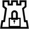

.. warning::

    This python project is not fully baked yet. When a full major version is bumped we will consider it functional. Until then enjoy reading the docs.

.. start-badges

.. raw:: html

    

        <!--
        
        -->
        
        
        
        <!--
        
        
        -->
        
    

.. end-badges

.. note::

    **TL;DR;** A set of certificate management utilities using a default Vault backend.

.. include:: ../README.md

Note, to combine the coverage data from all the tox environments run:

.. list-table::
    :widths: 10 90
    :stub-columns: 1

    - - Windows
      - ::

            set PYTEST_ADDOPTS=--cov-append
            tox

    - - Other
      - ::

            PYTEST_ADDOPTS=--cov-append tox

.. _Travis-CI: http://travis-ci.org/
.. _Tox: https://tox.readthedocs.io/en/latest/
.. _Sphinx: http://sphinx-doc.org/
.. _Coveralls: https://coveralls.io/
.. _ReadTheDocs: https://readthedocs.org/
.. _Setuptools: https://pypi.org/project/setuptools
.. _Pytest: http://pytest.org/
.. _AppVeyor: http://www.appveyor.com/
.. _Cookiecutter: https://github.com/audreyr/cookiecutter
.. _Nose: http://nose.readthedocs.org/
.. _isort: https://pypi.org/project/isort
.. _bumpversion: https://pypi.org/project/bumpversion
.. _Codecov: http://codecov.io/
.. _Landscape: https://landscape.io/
.. _Scrutinizer: https://scrutinizer-ci.com/
.. _Codacy: https://codacy.com/
.. _CodeClimate: https://codeclimate.com/
.. _`requires.io`: https://requires.io/
